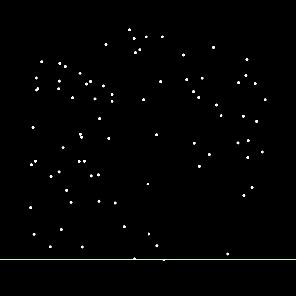

# fortune-algorithm
This is an implementation of [Fortune](http://ect.bell-labs.com/who/sjf/)'s sweep line algorithm in [Processing](https://processing.org/). [Fortune's Algorithm](https://en.wikipedia.org/wiki/Fortune%27s_algorithm) is used to generate the [Voronoi Diagram](https://en.wikipedia.org/wiki/Voronoi_diagram) of a set of points in the 2D plane. The Voronoi Diagram is partioning the plane into regions based on the distance between the input points. The Voronoi Diagram is highly useful for a number of applications, such as the [Nearest Neighbor Search](https://en.wikipedia.org/wiki/Nearest_neighbor_search), finding the maximum empty circle, [Vector Quantization](https://en.wikipedia.org/wiki/Vector_quantization).

The animation illustrates the steps involved algorithm. The implementation is based on the explanation of [Ivan Kuckir](http://blog.ivank.net/fortunes-algorithm-and-implementation.html) which was very helpful for the understanding and implementation of the algorithm. This implementation does not deal with many degenerate cases, which can cause problems for large set of input points.

